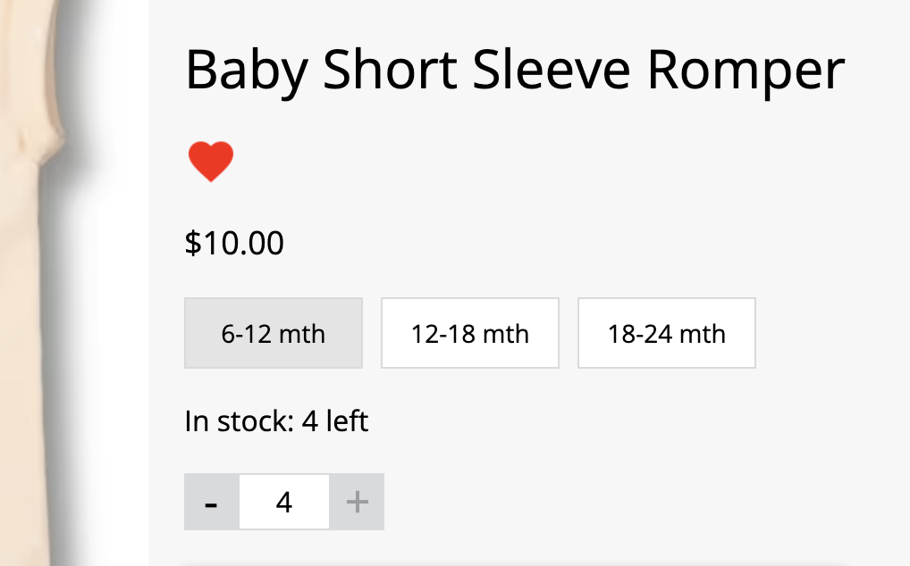
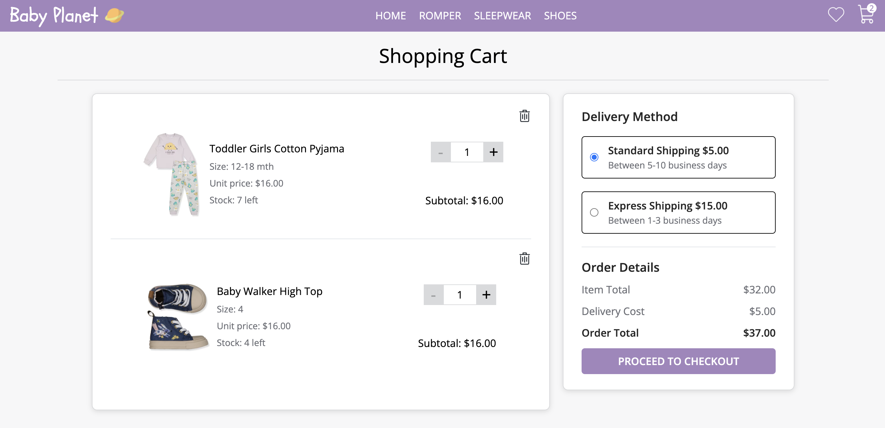
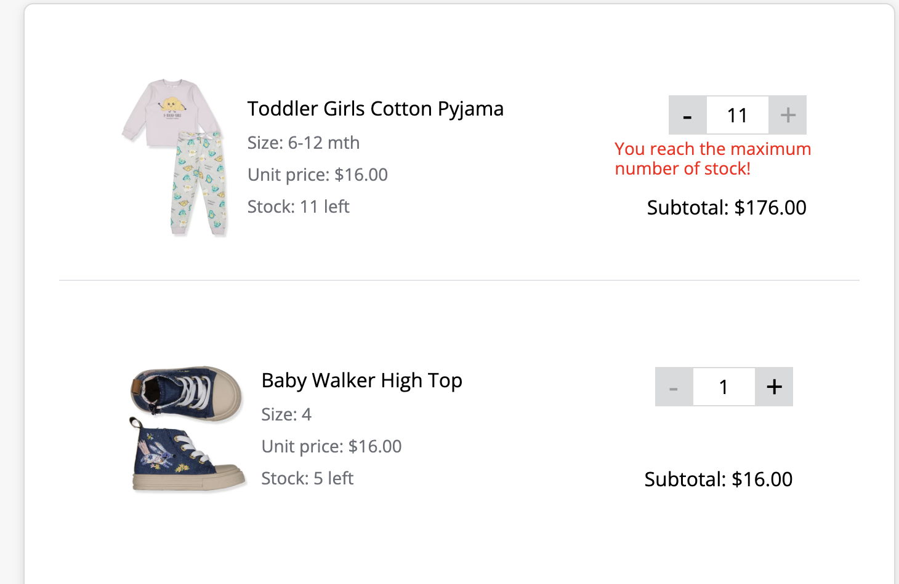
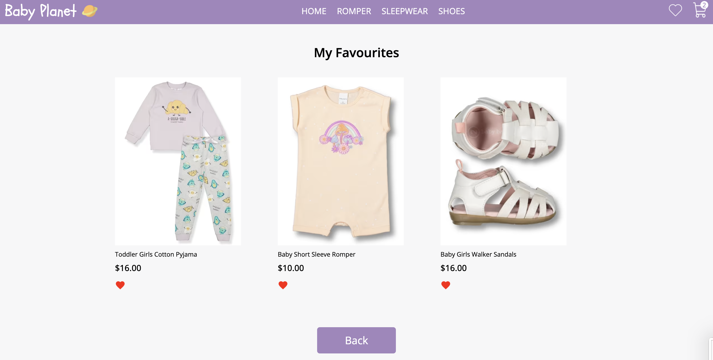

# E-Commerce 

This is a mock e-commerce baby cloths website that uses react and firestore. It has home page, products pages, individual product details page, cart and checkout page, and favourite items page. The products are stored as firestore documents and user interactions requiring persistence like a favourites product list or adding products to their cart using session storage.

### 🚀 [Launch Live Project](https://baby-planet.netlify.app/)

## Table of Contents

- [Snippets](#snippets)
- [Purpose](#purpose-of-project)
- [Tech Stack](#tech-stack)
- [Requirements](#requirements)
    - [MVP](#mvp)
    - [Bonus](#bonus)
- [Features](#features)
- [Known Issues](#known-issues)
- [Future Goals](#future-goals)

## Snippets

Home page  

Products page  

Product details page  

Cart/Checkout page  

Favourite items page  

## Purpose Of Project
This project is designed to reinforce my React learnings and make sure that I'm comfortable with most aspect of the framework.
With this project I will practice how to:
- Fetch Data within a React App
- Use react-router-dom
- Use Firebase/Firestore

## Tech Stack

- React
- HTML
- CSS/SCSS
- JavaScript
- React Router DOM
- Google Firestore NoSQL Database

## Requirements

### MVP
3 pages:

- Home Page
    - Grid of products
    - Carousel of featured products
- Product Page (with id parameter) 
    - Similar to a product page on another site, allows you to add to cart and select product variants
- Favourite-items Page
    - Grid of products which are added as favourited

All products should be stored in Firestore, you should store the following information:

-   quantity
-   variants (could be colors, sizes, etc)
-   price per unit
-   name
-   image url
-   favourited or not (boolean)

All data should be stored in Firestore and fetched by the frontend, there should
be NO static product data in the react application
### Bonus  
Using Firestore and react create a cart system. Add logic to prevent users from adding items to cart that are no longer in stock. Cart page should have the following:  
- List of products in cart
- Ability to change quantity of products in cart
- Ability to remove items from cart
- Display the total cost of your cart
- Purchase should remove items from stock and clear the cart (no need to track any kind of payment)

## Features

- This is a single page React project but have different url for rendering different component since it is using react-router-dom
- There is a carousel on the home page, which images are looping and auto changed every 3 seconds;
- On the product details page, click the heart symbol will mark/unmark the item as favourited item, and add/remove it from the favourited items page; users are able to choose a size of the product, and there will be information of how many stock left for this particular size; the user then can adjust the quantity they want to purchase and when the number reaches the stock number, the quantity add button will become disabled:  

- Just like a real e-commerce website, while there are items in the cart, the cart icon on the top right corner will show the numbers of items currently in the cart, users can then navigate to the cart page by clicking the cart icon:

- Users can adjust quantity of item in the cart page, and same as the one on the product details page, if the quantity reach the stock number, there will be an error message reminding the user and the quantity add button will be disabled:  

- Click on the heart icon on the top right corner will navigate to the favourited items page where all the favouried items are listed, users can un-favourited the items by clicking the red heart button under the product image and the product will be removed without refreshing the page: 

## Known Issues  
 This application currently doesn't have any functionality of login or register for an user account, so basically it is just a project for practising React and Firestore, the cart system actually doesn't have any meaning since the items added in the cart are saved in the session storage.  

## Future Goals

- To add a user registration or login functionality and a collection of users in the database
- Build backend for the project for all CRUD operations
- Change the functionality of adding items to the cart from saving items in session storage to saving to the database
