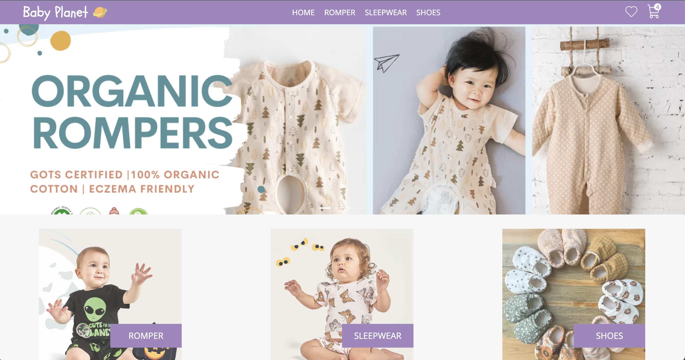
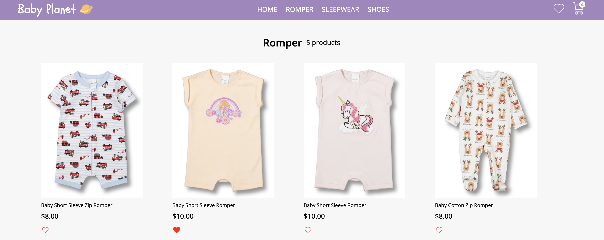
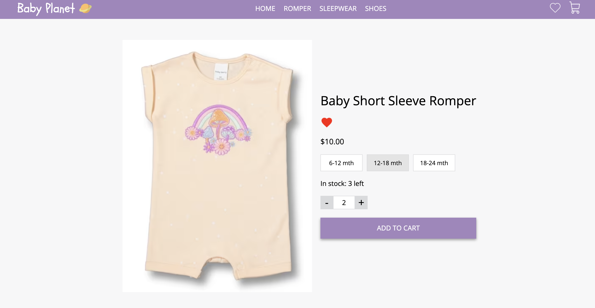
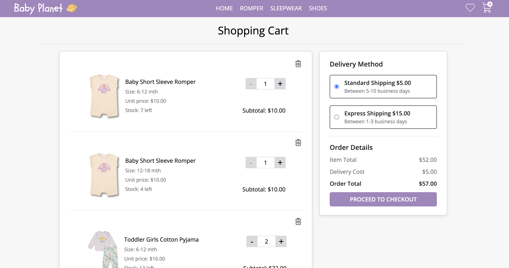
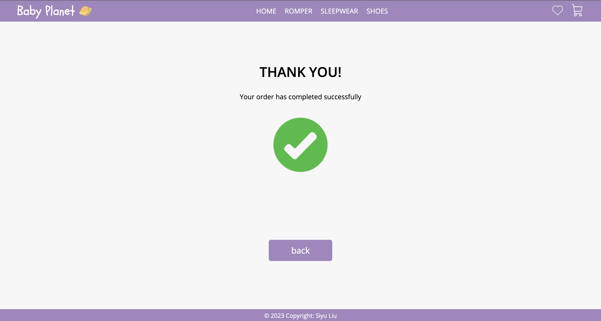
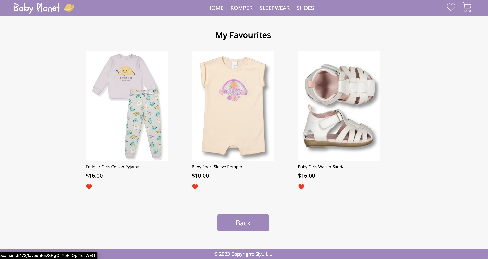

# Minesweeper

## Table of Contents
- [Overview](#overview)
- [Features](#features)
- [Contact](#contact)

## Overview

This is a mock e-commerce baby cloths website that uses react and firestore. It has home page, products pages, individual product details page, cart and checkout page, and favourite items page. The products are stored as firestore documents and user interactions requiring persistence like a favourites product list or adding products to their cart using session storage.

## Structure/Features

- Home Page
  - The home page contains:
    - Navbar
    - Carousel of featured products
    - A Grid of product categories
    - Product Page (with id parameter) Similar to a product page on another site, allows you to add to cart and select product variants
    
- Products page:
  - The products page contains:
    - All products under the particular category
    - Image of each product
    - Product name
    - Price per unit
    - Favourited or not
    
- Product details page:
  - The product details page contains:
    - Image of each product
    - Product name
    - Price per unit
    - Sizes options
    - Quantity button
    - Stock left
    - Add to cart button
    
- Cart/Checkout page:
  - The cart/checkout page has:
    - List of products in cart
    - Ability to change quantity of products in cart
    - Ability to remove items from cart
    - Display the total cost of the cart
    - Ability to choose delivery options and adds freight to the price 
    - Purchase will remove items from stock and clear the cart
    
    
- Favourited items page:
  - The favourited items page has:
    - List of products in cart which have been marked as favourited items
    - Ability to unmark the item and the item will be removed from the page without refresh
    - Ability to jump to a item's product details page when clicking on it
    
## Contact
If you have additional questions, please contact me at:    
My github link: https://github.com/gulama2008   
My email address: siyu.liu.job@gmail.com
